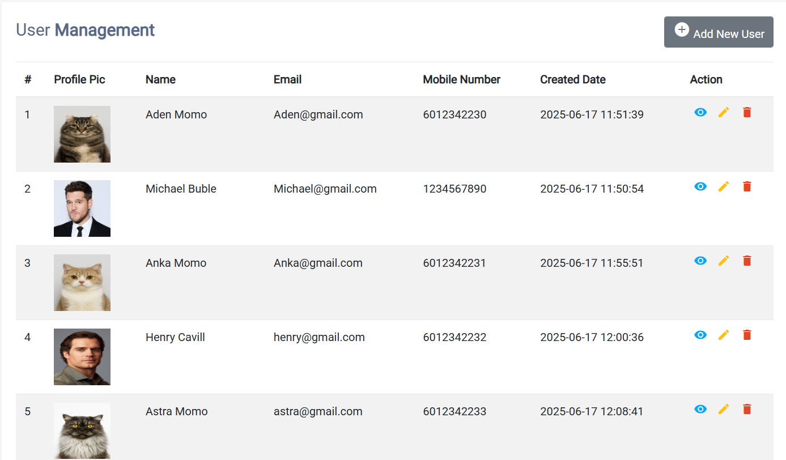
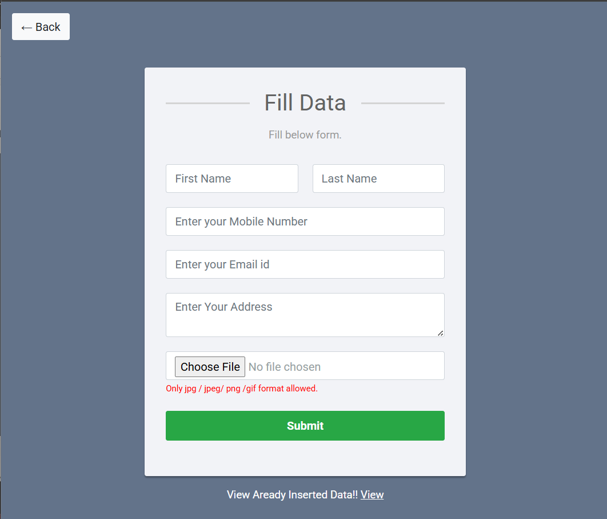
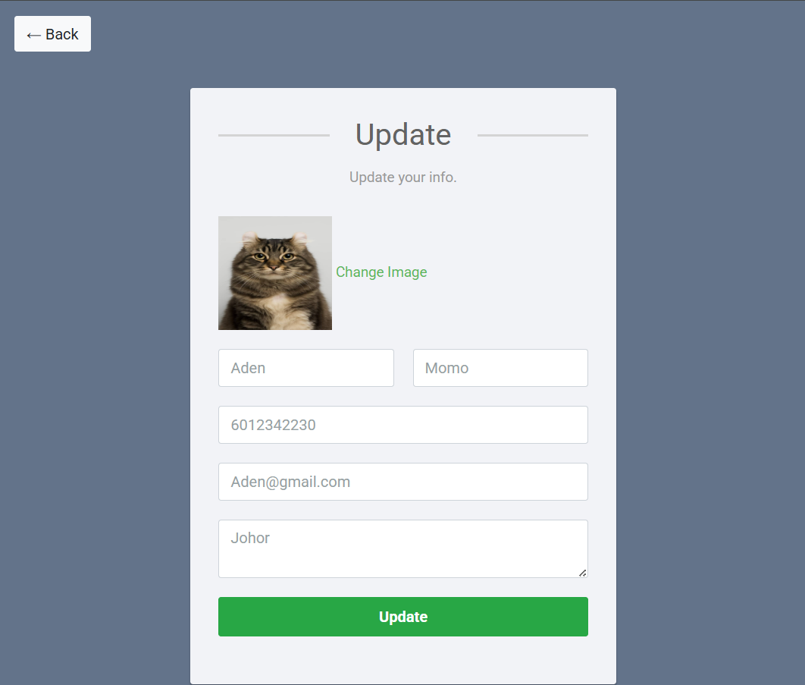

# CRUD Image Portfolio Project

Welcome to **CRUD Image**, a simple yet powerful PHP & MySQL CRUD application for managing user profiles with image uploads. This project demonstrates the core Create, Read, Update, and Delete operations, enhanced with profile picture management.

---

## 🚀 Features

- **Create** new users with profile images  
- **Read** and display user details in a responsive table  
- **Update** user information and profile pictures  
- **Delete** users (with confirmation)  
- **Image upload** with file type validation  
- **Bootstrap UI** for a modern, clean look

---

## 📸 Screenshots

Take a look at some of the key screens from the CRUD Image project:

### 🗂️ User List
See all users at a glance, complete with profile images and action buttons.

### ➕ Add User
Easily add a new user along with their profile picture.

### ✏️ Edit User
Update user details or change their profile image with a simple form.

### 👁️ View User Details
View complete information about a user in a clean, focused layout.

---

## 🛠️ Tech Stack

- **PHP** (Procedural)
- **MySQL** (MariaDB compatible)
- **Bootstrap 4**
- **HTML/CSS**

---

## 🏗️ How It Works

1. **Clone the repository**
2. Import the SQL file:  
   `crudimage/SQL File/tblusers.sql`  
   into your MySQL database.
3. Update your database credentials in [`crudimage/dbconnection.php`](dbconnection.php).
4. Place your profile images in the `profilepics/` folder.
5. Run the project on your local server (e.g., XAMPP, WAMP, Laragon).

---

## 📂 Project Structure

- `index.php` — User listing & actions  
- `insert.php` — Add new user  
- `edit.php` — Edit user details  
- `change-image.php` — Change profile picture  
- `read.php` — View user details  
- `dbconnection.php` — Database connection  
- `profilepics/` — Profile images  
- `SQL File/tblusers.sql` — Database schema & sample data

---

## 🌟 Why This Project?

This project is perfect for learning and demonstrating:

- Basic PHP CRUD operations
- File upload handling and validation
- Bootstrap-based responsive design
- Clean code structure for beginners

---

## 🔗 See More Projects

Check out more of my work on my [GitHub profile](https://github.com/ammaribrahim95)!

---

## 📬 Contact

Feel free to connect or reach out for collaboration!

---

> _⭐️ If you like this project, don’t forget to star the repo!_